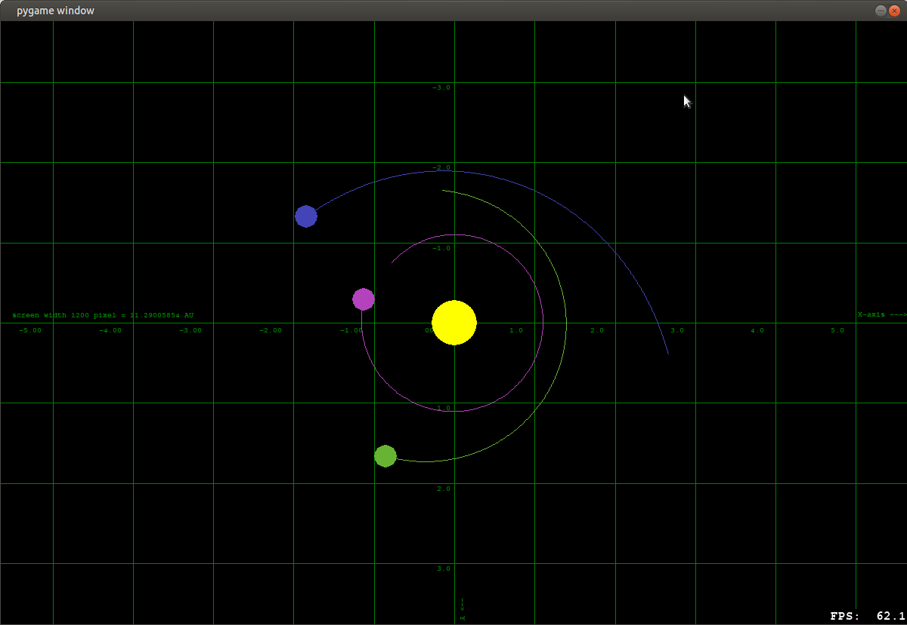

# SolarSystem
simple python3 Solar System simulation, currently with pygame, later maybe with different engines

## requirements

python, pygame

## instructions
edit the __init__ method of class Game to create more planets

zoom in / out with Keypad +/-
reset zoom with Keypad Enter
pan view with Keypad2,4,8,6
re-center on sun with Keypad5

### screenshots

